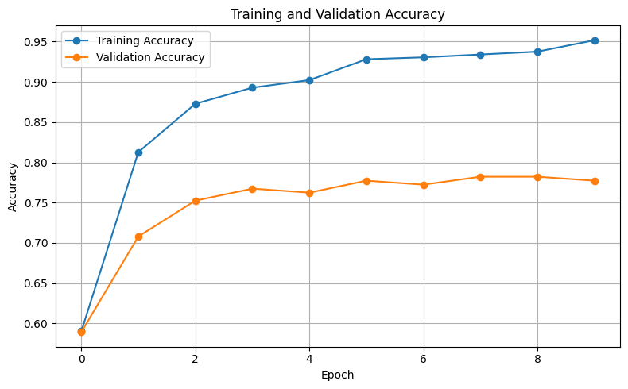
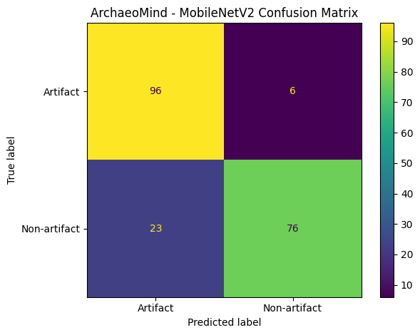

# ArchaeoMind: Archaeological Artifact Classification using CNN

## Overview

ArchaeoMind is a deep learning–based framework for automated classification of archaeological artifact images. The system uses Convolutional Neural Networks (CNNs) and transfer learning to distinguish between archaeological artifacts and non-artifact images.

The project aims to support digital archaeology, cultural heritage documentation, and automated image-based artifact screening.

## Dataset

A custom archaeological image dataset was created and publicly released on Kaggle.

- Total images collected: **1,349**
- Valid images after preprocessing: **1,252**
- Training images: **849**
- Validation images: **202**
- Test images: **201**

### Class Distribution

| Split | Artifact | Non-artifact | Total |
|---|---:|---:|---:|
| Training | 383 | 466 | 849 |
| Validation | 101 | 101 | 202 |
| Test | 102 | 99 | 201 |

### Kaggle Dataset

[ArchaeoMind Dataset on Kaggle](https://www.kaggle.com/datasets/abhinavrama22/archaeomind-images)

## Model

The primary ArchaeoMind model uses **MobileNetV2 with ImageNet-pretrained weights**.

### Configuration

- Architecture: **MobileNetV2**
- Learning approach: **Transfer Learning**
- Pretrained weights: **ImageNet**
- Input size: **224 × 224 × 3**
- Optimizer: **Adam**
- Learning rate: **0.0001**
- Loss function: **Binary Cross-Entropy**
- Epochs: **10**
- Training batch size: **32**
- Validation/Test batch size: **16**
- Dropout: **0.3**
- Classification: **Binary**
- Classes: **Artifact / Non-artifact**

The pretrained MobileNetV2 convolutional base was kept frozen while a custom classification head was trained.

## Data Augmentation

The training pipeline applies the following augmentation techniques:

- Rotation: ±20°
- Width shift: 0.1
- Height shift: 0.1
- Zoom: 0.1
- Horizontal flipping

## Experimental Evaluation

To evaluate the stability and consistency of the model, experiments were repeated using three random seeds:

- **42**
- **123**
- **2026**

The reported values are calculated as **mean ± standard deviation** across the three runs.

### MobileNetV2 Results

| Metric | Mean ± Standard Deviation |
|---|---:|
| Test Accuracy | **86.90% ± 1.15%** |
| ROC-AUC | **93.62% ± 0.69%** |

### EfficientNet-B0 Comparison

An EfficientNet-B0 baseline was also evaluated using the same dataset split and experimental protocol.

| Model | Test Accuracy (%) | ROC-AUC (%) |
|---|---:|---:|
| MobileNetV2 | **86.90 ± 1.15** | **93.62 ± 0.69** |
| EfficientNet-B0 | **88.39 ± 0.29** | **95.76 ± 0.19** |

EfficientNet-B0 achieved slightly higher classification performance, while MobileNetV2 provides a more lightweight architecture suitable for resource-constrained deployment.

## Training and Validation Accuracy

The following figure shows the training and validation accuracy across the 10 training epochs.



## Confusion Matrix

The confusion matrix illustrates the classification performance of the MobileNetV2 model on the test dataset.



## Features

- End-to-end CNN classification pipeline
- Image preprocessing and normalization
- Data augmentation
- Transfer learning using ImageNet
- Binary artifact/non-artifact classification
- Accuracy and ROC-AUC evaluation
- Confusion matrix analysis
- Training and validation accuracy visualization
- Confidence-score-based image prediction
- Trained model saving and inference support
- Reproducible evaluation using multiple random seeds

## Project Structure

```text
ArchaeoMind/
│
├── ArchaeoMind_CNN.ipynb
├── accuracy_curve.png
├── confusion_matrix.png
├── archaeomind_cnn_model.keras
├── LICENSE
└── README.md
```

## How to Run

### Using Google Colab

1. Clone or open this repository.
2. Open `ArchaeoMind_CNN.ipynb`.
3. Open the notebook in Google Colab.
4. Run the cells sequentially from the beginning.
5. The dataset is downloaded automatically using KaggleHub.
6. The images are preprocessed and augmented.
7. The MobileNetV2 model is trained for 10 epochs.
8. The model is evaluated on the validation and test datasets.
9. Accuracy, classification report, ROC-AUC, and confusion matrix results are generated.
10. The trained model is saved as `archaeomind_cnn_model.keras`.

### Testing an Unseen Image

The notebook includes an inference function that allows users to upload JPG images and obtain predictions.

The model classifies an image as either:

```text
Artifact Detected
```

or

```text
Non-Artifact Detected
```

along with a confidence score.

## Limitations

- The dataset is relatively small compared with large-scale general-purpose image datasets.
- The current system performs binary classification.
- Model performance may vary when applied to archaeological collections with substantially different visual characteristics.
- Real-world archaeological images may contain variations in lighting, background, scale, orientation, and image quality that are not fully represented in the dataset.

## Future Work

Future development of ArchaeoMind may include:

- Expanding the dataset with additional archaeological site and museum images
- Extending the system to multi-class artifact classification
- Fine-tuning deeper layers of the pretrained network
- Improving robustness across different archaeological collections
- Integrating the system with archaeological information systems
- Exploring mobile and resource-constrained deployment
- Evaluating the framework on larger and more diverse real-world datasets

## Reproducibility

The main notebook uses a fixed random seed for reproducibility and provides the complete preprocessing, training, evaluation, and inference pipeline.

The experimental evaluation additionally uses three random seeds (**42, 123, and 2026**) to assess performance variability.

## License

This project is released under the **MIT License**.

See the [LICENSE](LICENSE) file for details.

## Author

**Abhinav Rama**

ArchaeoMind — Archaeological Artifact Classification using CNN
